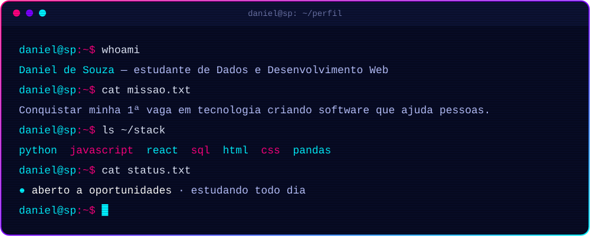

<!-- ==========================================================================
  README DE PERFIL · Daniel de Souza
  Paleta: #050816 fundo · #00F0FF cyan · #0066FF azul · #7A00FF violeta · #FF007F pink
  Os arquivos visuais ficam na pasta /assets (SVGs animados, sem JavaScript).
  Tudo que estiver marcado com "EDITE" é para você personalizar.
========================================================================== -->

<div align="center">



<br/>


[](https://www.linkedin.com/in/daniel-souza-8b554335b/)
[](mailto:danielsouzapython@gmail.com)
[](https://github.com/Dansouza-web)

</div>

<br/>

<h2></h2>

<div align="center">
  
</div>

<br/>

Oi, eu sou o **Daniel**! 👋

Moro em **São Paulo** e estou construindo minha carreira em tecnologia, com foco em **desenvolvimento web** e **análise de dados**. Hoje estudo Python, JavaScript, SQL e React e sigo praticando todo dia para conquistar minha primeira oportunidade na área.

O que me move é transformar dados e ideias em produtos que realmente ajudam pessoas. Fora do código, gosto de música e quero juntar as duas coisas em projetos com JavaScript, HTML e CSS.

| | |
|:--|:--|
| 📍 **Base** | São Paulo, Brasil |
| 🎯 **Foco** | Desenvolvimento web e análise de dados |
| 🔭 **Estudando agora** | Python · JavaScript · React · SQL · HTML · CSS |
| 🚀 **Procurando** | Minha primeira oportunidade em tecnologia <!-- EDITE --> |
| 💬 **Pergunte-me sobre** | análise de dados, acessibilidade e como é aprender a programar do zero |

<br/>

<h2></h2>

<!-- EDITE: deixe só o que realmente faz sentido para você -->

- 🌐 Desenvolvimento Web (Front-end)
- 📊 Análise e Visualização de Dados
- 🤖 Machine Learning e Visão Computacional
- ♿ Acessibilidade e Tecnologia
- 🎵 Música e Programação

<br/>

<h2></h2>

> Organizei por **nível real de experiência**, sem barrinhas de porcentagem inventadas. Esta lista cresce junto comigo. <!-- EDITE: ajuste os grupos conforme você evoluir -->

**🟢 Base sólida**


**🔵 Praticando todo dia**


**🟣 Explorando**


-050816?style=for-the-badge&logo=opencv&logoColor=00F0FF)

<br/>

<h2></h2>

```python
class Daniel:
    def __init__(self):
        self.nome = "Daniel de Souza"
        self.base = "São Paulo, Brasil"
        self.foco = ["Desenvolvimento Web", "Análise de Dados"]
        self.estudando = ["Python", "JavaScript", "React", "SQL"]
        self.missao = "Criar software que ajuda pessoas"

    def aprender(self):
        return "Um commit de cada vez 🚀"
```

<!-- EDITE: quando tiver um projeto pronto e publicado, é aqui que entra a seção de PROJETOS. -->

<br/>

<h2></h2>

<div align="center">


</div>

<br/>

<h2></h2>

Quer trocar uma ideia sobre dados, desenvolvimento web ou carreira em tech, ou tem uma oportunidade? Me chama, vou adorar conversar. 💜

<div align="center">

[](https://www.linkedin.com/in/daniel-souza-8b554335b/)
[](mailto:danielsouzapython@gmail.com)

</div>

<details>
<summary>⚙️ Como este README foi feito</summary>

<br/>

- Banner, terminal e cabeçalhos são **SVGs animados** que ficam na pasta `assets/`, feitos só com SVG e CSS/SMIL (sem JavaScript e sem depender de serviços externos).
- Os cartões de estatísticas vêm do `github-readme-stats`, `streak-stats`, `github-readme-activity-graph` e `github-profile-trophy`, todos usando a minha paleta.
- A cobrinha das contribuições é gerada automaticamente por um **GitHub Action** (`.github/workflows/snake.yml`) a cada 12 horas.
- Cores: `#050816` · `#00F0FF` · `#0066FF` · `#7A00FF` · `#FF007F`

</details>

<br/>


